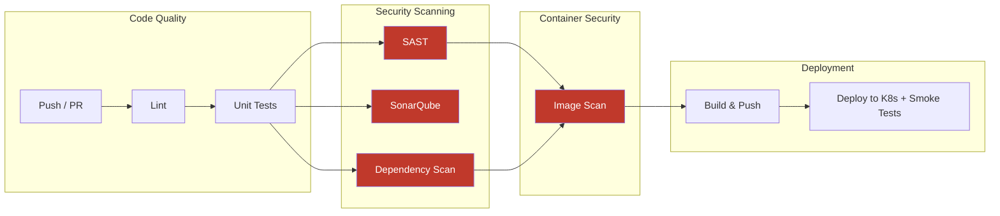

# DevSecOps CI/CD Pipeline

[](https://github.com/Orchid1337/devsecops-pipeline/actions/workflows/pipeline.yml)
[](https://github.com/Orchid1337/devsecops-pipeline/security)
[](https://github.com/Orchid1337/devsecops-pipeline/actions)
[](LICENSE)

End-to-end CI/CD pipeline with security scanning at every stage. The app itself is a simple FastAPI REST API — the focus is the pipeline and security tooling around it.

Every push triggers 8 pipeline stages. If any security gate fails, nothing gets deployed.

## Architecture



## Pipeline Stages

| # | Stage | Tool | Blocks deploy if |
|---|-------|------|-----------------|
| 1 | Lint | Ruff + Hadolint | Any code style or Dockerfile issue |
| 2 | Tests | pytest (16 tests, 93% coverage) | Any test fails |
| 3 | SAST | Semgrep (OWASP Top 10 + custom rules) | HIGH+ severity finding |
| 4 | Quality | SonarQube | Quality Gate fails (PR only) |
| 5 | Dependencies | OWASP Dependency-Check | CVSS ≥ 7 |
| 6 | Container | Trivy | CRITICAL/HIGH in Python libraries |
| 7 | Build | Docker + GHCR | Build failure |
| 8 | Deploy | Kind + kubectl + smoke tests | Any endpoint unreachable |

## Security Controls

| Tool | What it catches |
|------|----------------|
| **Ruff** | Code quality, potential bugs, unsafe patterns |
| **Hadolint** | Dockerfile misconfigs (running as root, missing flags) |
| **Semgrep** | SQL injection, hardcoded secrets, unsafe deserialization |
| **SonarQube** | Code smells, security hotspots, duplication |
| **OWASP Dep-Check** | Known CVEs in pinned dependencies |
| **Trivy** | Vulnerabilities in container image layers |
| **detect-secrets** | Accidentally committed API keys/tokens |
| **K8s Network Policies** | Lateral movement between pods |
| **Security Context** | Container escape, privilege escalation |

## Quick Start

```bash
# run locally with docker
docker compose up --build
# API at http://localhost:8000, docs at http://localhost:8000/docs

# or without docker
pip install -r requirements.txt
uvicorn app.main:app --reload

# run tests
make test

# run the full pipeline locally (requires act)
act push -j lint
act push -j test
```

## Makefile

```bash
make lint      # ruff + hadolint
make test      # pytest with coverage
make scan      # semgrep + trivy
make run       # docker compose up
make deploy    # kind cluster + kubectl apply
make clean     # tear down everything
```

## API Endpoints

| Method | Path | Description |
|--------|------|-------------|
| GET | `/health` | Liveness probe |
| GET | `/ready` | Readiness probe |
| GET | `/api/v1/users/` | List users |
| POST | `/api/v1/users/` | Create user (validated email + username) |
| GET | `/api/v1/users/{id}` | Get user by ID |
| DELETE | `/api/v1/users/{id}` | Delete user |
| GET | `/api/v1/items/` | List items |
| POST | `/api/v1/items/` | Create item (XSS sanitized, price validated) |
| GET | `/api/v1/items/{id}` | Get item |
| PUT | `/api/v1/items/{id}` | Update item |
| DELETE | `/api/v1/items/{id}` | Delete item |

## Kubernetes Hardening

Not boilerplate — real security controls:

- `runAsNonRoot` + `runAsUser: 1000` — no root in container
- `readOnlyRootFilesystem` — can't write to disk (tmpfs for /tmp)
- `capabilities.drop: [ALL]` — zero Linux capabilities
- `allowPrivilegeEscalation: false` — blocks setuid
- `automountServiceAccountToken: false` — no K8s API access from pod
- Default-deny network policy + explicit allow from ingress only
- Resource limits (CPU/memory) to prevent exhaustion
- Rolling update strategy with liveness/readiness probes

## Custom Semgrep Rules

`.semgrep/custom-rules.yml` includes three original rules:

1. **Hardcoded secret detection** — catches `password = "actual_value"` patterns while ignoring test placeholders
2. **SQL injection via string formatting** — flags f-strings, %-formatting, and `.format()` in SQL queries
3. **Unsafe YAML loading** — catches `yaml.load()` without `safe_load()`

## Project Layout

```
├── .github/workflows/pipeline.yml   # 8-stage CI/CD pipeline
├── app/                             # FastAPI app (models, routers, tests)
├── k8s/                             # deployment, service, ingress, netpol
├── scripts/smoke_test.py            # post-deploy endpoint validation
├── .semgrep/custom-rules.yml        # 3 custom security rules
├── Dockerfile                       # multi-stage, non-root, minimal
├── docker-compose.yml               # local dev
├── docker-compose.sonarqube.yml     # local SonarQube
├── Makefile                         # dev shortcuts
├── SECURITY.md                      # vulnerability disclosure policy
└── docs/branch-protection.md        # recommended GitHub settings
```

## What I Learned

Security gates only work if they're mandatory. I made every scan a hard blocker because optional checks get ignored under deadline pressure. The tricky part was tuning thresholds — CVSS ≥ 7 for dependencies and CRITICAL/HIGH for our own libraries (not OS packages) turned out to be the right balance. I also learned that writing custom Semgrep rules is surprisingly approachable and catches things generic rulesets miss. The biggest practical lesson: each CI job runs on a fresh runner, so things like Kind clusters don't persist between jobs — you have to design your pipeline stages with that isolation in mind.

## License

MIT
