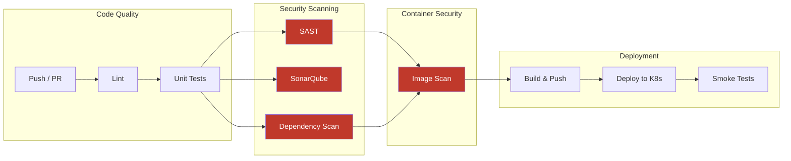

# DevSecOps CI/CD Pipeline

[](https://github.com/Orchid1337/devsecops-pipeline/actions/workflows/pipeline.yml)
[](https://github.com/Orchid1337/devsecops-pipeline/security)
[](https://github.com/Orchid1337/devsecops-pipeline/actions)
[](LICENSE)

A fully automated CI/CD pipeline with security scanning integrated at every stage. The application is a simple FastAPI REST API — the real focus here is the pipeline itself and how security tooling fits into a modern delivery workflow.

Every commit triggers 8 pipeline stages. If any security gate fails, nothing gets deployed. No manual overrides, no skipping scans.

## How the Pipeline Works



### Pipeline Stages

| # | Stage | Tool | What happens | Blocks deploy if |
|---|-------|------|-------------|-----------------|
| 1 | Lint | Ruff + Hadolint | Checks Python code style and Dockerfile best practices | Any warning |
| 2 | Tests | pytest | Runs 16 unit tests, generates coverage report (93%) | Any test fails |
| 3 | SAST | Semgrep | Static analysis for injections, secrets, OWASP Top 10 | HIGH severity finding |
| 4 | Quality | SonarQube | Code quality, duplication, security hotspots | Quality Gate fails |
| 5 | Dependencies | OWASP Dep-Check | Scans all packages for known CVEs | CVSS score ≥ 7 |
| 6 | Container | Trivy | Scans built Docker image for vulnerabilities | CRITICAL vuln found |
| 7 | Build | Docker + GHCR | Builds image, tags with SHA, pushes to registry | Build failure |
| 8 | Deploy | Kind + kubectl | Deploys to Kubernetes, runs smoke tests | Any endpoint down |

## The Application

A REST API with basic CRUD operations. Intentionally simple — it exists to give the pipeline something real to scan and deploy.

**Endpoints:**
- `GET /health` — liveness probe for Kubernetes
- `GET /ready` — readiness probe
- `GET/POST /api/v1/users/` — list and create users
- `GET/DELETE /api/v1/users/{id}` — get or remove a user
- `GET/POST /api/v1/items/` — list and create items
- `GET/PUT/DELETE /api/v1/items/{id}` — get, update, or remove an item

**Security features in the app itself:**
- Input validation via Pydantic (email format, username charset, price bounds)
- XSS character stripping on item names
- Restrictive CORS policy
- No secrets in code, no debug mode, no stack traces in responses

## Kubernetes Security

The K8s manifests aren't boilerplate — they implement actual hardening:

- **Non-root container** (`runAsUser: 1000`)
- **Read-only filesystem** (writable `/tmp` via emptyDir)
- **All capabilities dropped** — zero Linux capabilities
- **No privilege escalation** — blocks setuid/setgid binaries
- **No service account token** — pod can't talk to K8s API
- **Network policies** — default deny-all, explicit allow only from ingress controller
- **Resource limits** — prevents resource exhaustion
- **Rolling updates** — zero-downtime deploys with health checks

## Running Locally

```bash
# With Docker
docker compose up --build
# API at http://localhost:8000, Swagger docs at http://localhost:8000/docs

# Without Docker
pip install -r requirements.txt
uvicorn app.main:app --reload

# Run tests
pytest app/tests/ -v

# Run pipeline locally (requires act: https://github.com/nektos/act)
act push -j lint
act push -j test
```

## Makefile

```bash
make lint      # ruff + hadolint
make test      # pytest with coverage
make scan      # semgrep + trivy
make run       # docker compose up
make deploy    # spin up kind cluster + deploy
make clean     # tear down everything
make sonarqube # start local SonarQube
```

## Security Tools & What They Catch

| Tool | Threat | Example |
|------|--------|---------|
| **Semgrep** | Code-level vulnerabilities | SQL injection via f-strings, hardcoded passwords, unsafe YAML loading |
| **Trivy** | Container vulnerabilities | Outdated OS packages, vulnerable Python libraries in the image |
| **OWASP Dep-Check** | Supply chain attacks | Known CVEs in pinned dependencies |
| **Hadolint** | Docker misconfigs | Running as root, using `latest` tag, missing `--no-cache-dir` |
| **detect-secrets** | Leaked credentials | API keys, tokens, passwords accidentally committed |
| **Network Policies** | Lateral movement | Compromised pod can't reach other services |
| **Security Context** | Container escape | Even if RCE achieved, attacker has no capabilities |

## Custom Semgrep Rule

I wrote a custom rule (`.semgrep/custom-rules.yml`) that catches hardcoded secrets:

```yaml
# Catches: password = "actual_secret_here"
# Ignores: password = "test_placeholder" (has 'test' in value context)
```

It also catches SQL injection via string formatting and unsafe `yaml.load()` calls.

## What I Learned

Security gates only matter if they're mandatory — an optional scan will get skipped the moment there's a deadline. I made every check a hard blocker because fixing a 5-minute lint issue is always cheaper than dealing with a production vulnerability. The hardest part was calibrating thresholds: too strict and you get alert fatigue, too loose and real issues slip through. CVSS ≥ 7 for dependencies and CRITICAL-only for containers ended up being the right balance for this project's risk profile.

## License

MIT
